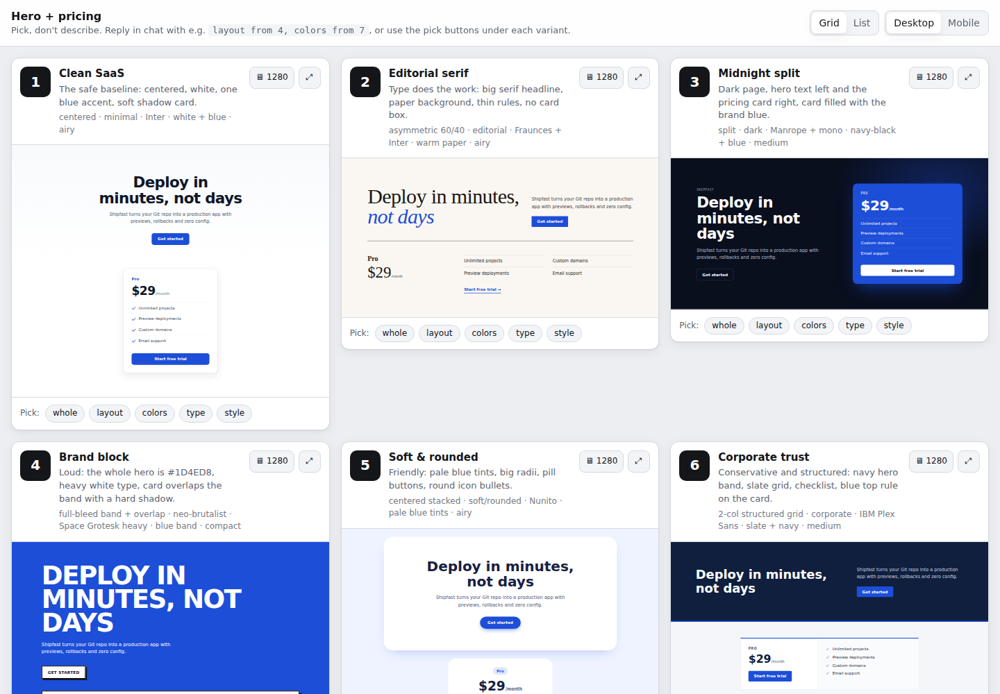

# pick-dont-describe

**Don't describe a vision you don't have. Pick one.**

"Make it more modern and professional" never works, and it's not the model's fault: I was asking it for a vision I didn't have myself. So now, for every vague UI edit, I get 10 genuinely different variants side by side, point at what I like ("layout from 4, colors from 7"), and iterate only on the picks until one is left. This Claude skill does that habit for me: I prompt like always, and it notices the vague request and offers variants first.



## Install

**Claude Code — personal (all projects):**

```bash
git clone https://github.com/HarnasDGE/X-variants ~/.claude/skills/pick-dont-describe
```

**Claude Code — one project:** clone into `.claude/skills/pick-dont-describe` in your repo instead.

**claude.ai:** download this repo as a ZIP (Code → Download ZIP), then upload it in *Settings → Capabilities → Skills*.

That's it. No dependencies, no build step.

## Usage

Just prompt like always.

```
You:    make the pricing card more modern

Claude: That's a style call with no fixed direction yet. Want me to prepare
        variants so you can pick instead of describe?
        1. Local preview — a standalone HTML file you open in the browser (default)
        2. Artifact — a shareable page you can send to your team
        3. No, just do one version

You:    1

Claude: Done → .variants/pricing-card-variants.html (opened in your browser).
        1 · Clean SaaS   2 · Editorial serif   3 · Dark neon accent
        4 · Split brutal   5 · Soft pastel   ...   10 · Retro terminal

You:    layout from 4, colors from 7

Claude: Round 2 is in the same file: 3 combinations of 4's split layout
        with 7's dark palette. Which one?

You:    R2-2, ship it

Claude: Applied to src/components/PricingCard.jsx using your Tailwind theme.
        Delete .variants/?
```

The preview page has a grid/list toggle, desktop/mobile widths, a full-screen view, tabs for each round, and pick buttons that build the "layout from 4, colors from 7" reply for you.

### When it kicks in

Vague style requests on any UI (HTML/CSS, React, Vue, Svelte, Tailwind, SwiftUI, Flutter, email templates...): *more modern, more professional, cleaner, nicer, make it pop, redesign this, it looks boring, zrób to ładniej* — in any language.

It stays out of the way for concrete edits ("button to #2563EB", "title 32px"), bug and accessibility fixes, refactors, Figma/reference matching, and design-system rules.

## Options

- **Count:** "give me 5" (default 10).
- **Local or shared:** local HTML file (default) or an artifact link you can send to your team.
- **Turn it off:** say "just do it", "one version" or "no variants". It won't ask again for that element in the session.
- **Keep constraints:** "more modern, keep our brand blue" → the blue stays in every variant.

Tip: add `.variants/` to your `.gitignore`.

## What's inside

```
SKILL.md                      the workflow Claude follows
references/variant-axes.md    how to make 10 variants that are actually different
references/trigger-examples.md  when to offer variants and when not to
templates/preview.html        the comparison page
examples/                     tiny sample projects to try it on
```

## Author

Made by Damian ([HarnasDGE](https://github.com/HarnasDGE)) · [LinkedIn](LINKEDIN_URL)

MIT License.
